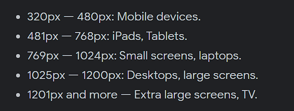

# Module 2

## Advanced CSS

### Links

[Media Query's](https://www.w3schools.com/css/css3_mediaqueries.asp)

[Normalize CSS](https://necolas.github.io/normalize.css/)

### Notes

- The two main media query's are screens and printers

- `flex-wrap: wrap;` will automatically stack flex items if they would otherwise go off the screen

### Examples

Example of using a screen media query to change an element at a certain screen size

```
@media screen and (max-width: 992px) {
    header {
        background-color: black;
    }
}
```

Popular screen sizes

